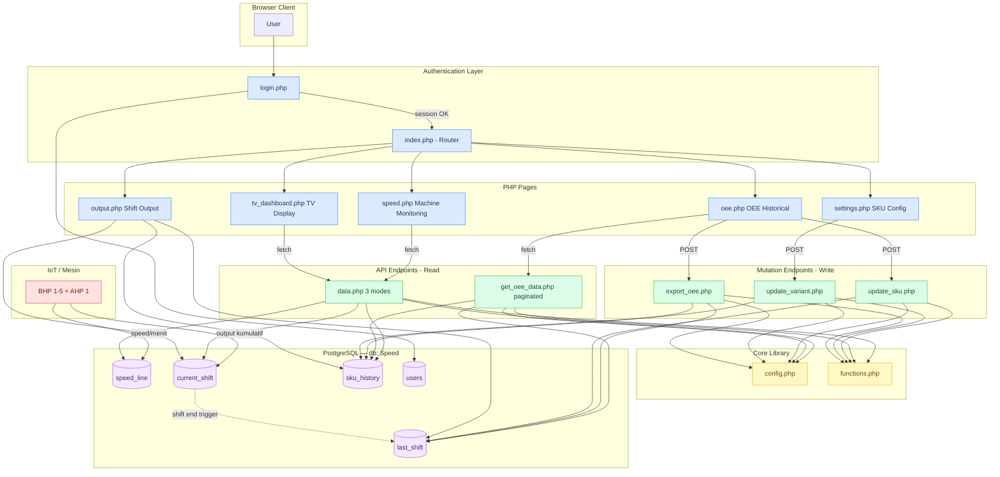
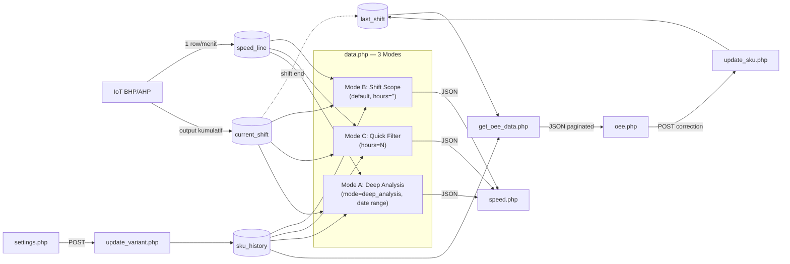
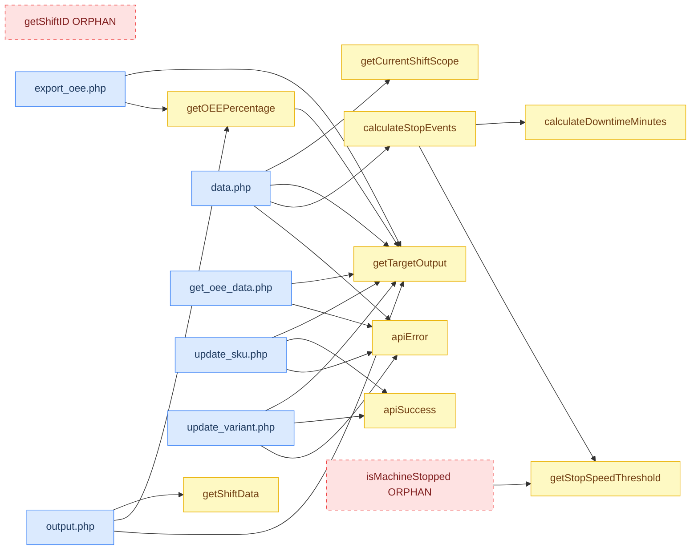

# Speed_Mesin — Architecture Documentation
> Auto-generated via GitNexus + LangGraph + Mermaid | 2026-06-08

---

## 1. System Architecture Overview



---

## 2. Layer Breakdown

| Layer | Files | Tanggung Jawab |
|---|---|---|
| **Auth** | login.php, index.php | Session management, routing |
| **View** | speed.php, oee.php, output.php, settings.php, tv_dashboard.php, header.php | HTML + Chart.js frontend |
| **API Read** | data.php, get_oee_data.php | JSON data untuk frontend |
| **API Write** | update_sku.php, update_variant.php, export_oee.php | Mutasi DB + export |
| **Core** | config.php, functions.php | DB connection, business logic |
| **DB** | speed_line, current_shift, last_shift, sku_history, users, ... | Persistence |
| **IoT** | BHP 1-5, AHP 1 | Hardware producer (write langsung ke DB) |

---

## 3. Data Flow



### data.php — 3 Mode Request/Response

| Mode | Trigger | Input | Output Keys |
|---|---|---|---|
| **B — Shift Scope** | `hours=''` (default) | - | `speed, latest_speed, realtime_output, audit_output, settings, shift_info, chart_labels, shift_targets, stop_events, mode` |
| **C — Quick Filter** | `hours=N` | N jam (1–24) | `speed, latest_speed, realtime_output, audit_output, settings, stop_events, hours_requested` |
| **A — Deep Analysis** | `mode=deep_analysis` | `machine, date_from, date_to, start, end` | `{machineName: {labels, values, total_audit, target_range, hours_in_range, stop_events}}` |

---

## 4. Function Call Graph



---

## 5. Input/Output Dependency Map

### Core Functions

| Fungsi | File | Input | Output | Callers |
|---|---|---|---|---|
| `getTargetOutput` | functions.php:28 | `deviceId: string, sku: string` | `int` (target atau -1) | data.php, get_oee_data.php, update_sku.php, update_variant.php, export_oee.php, output.php |
| `getOEEPercentage` | functions.php:47 | `output: int, deviceId: string, sku: string` | `int 0-100` atau `-1` | export_oee.php, output.php |
| `getCurrentShiftScope` | functions.php:99 | _(none)_ | `{name, start, end, elapsed_min, total_min}` | data.php |
| `getShiftData` | functions.php:84 | `pdo: PDO, tableName: string` | `[devId_noSpace => output_int]` | output.php |
| `getStopSpeedThreshold` | functions.php:58 | _(none)_ | `int` (5) | calculateStopEvents, isMachineStopped |
| `apiSuccess` | functions.php:151 | `data: array` | JSON echo + exit | update_sku.php, update_variant.php |
| `apiError` | functions.php:142 | `message: string, httpCode: int` | JSON echo + exit | data.php, get_oee_data.php, update_sku.php, update_variant.php |
| `calculateDowntimeMinutes` | data.php:7 | `startTs: string, endTs: string` | `int` (menit, min 1) | calculateStopEvents |
| `calculateStopEvents` | data.php:19 | `historyData: array, machineList: array, threshold?: int` | `{machineName: {count, total_duration, last_stop, all_stops[]}}` | data.php (semua mode) |

### Target Lookup Rules

```
getTargetOutput(deviceId, sku):
  AHP*  → TARGETS_AHP[sku]           // M10=144K, M1=120K, L8=120K, L1=120K, XL6=120K, XL1=120K
  BHP4 | BHP5 → TARGETS_HIGH_SPEED[sku] ?? TARGETS_BHP[sku]
                                      // S40=336K, XL26=336K, M32=384K, L28=384K
  BHP1-3      → TARGETS_BHP[sku]    // S1=240K, M1=240K, L1=223.2K, XL1=201.6K, XXL24=184.8K
  SKU tidak ada di array → return -1
```

### Shift Boundary (sumber kebenaran — functions.php)

| Shift | Range | Catatan |
|---|---|---|
| SHIFT 1 | 06:00:00 – 13:59:59 | Same day |
| SHIFT 2 | 14:00:00 – 21:59:59 | Same day |
| SHIFT 3 | 22:00:00 – 05:59:59 | Cross-midnight |

---

## 6. Relevance Analysis — Aktif vs Tidak Relevan

### ✅ AKTIF & RELEVAN

| Simbol | Alasan |
|---|---|
| `getTargetOutput` | Dipanggil 6 file — central to OEE |
| `getCurrentShiftScope` | Core logic Mode B di data.php |
| `calculateStopEvents` | Semua mode data.php menggunakan ini |
| `calculateDowntimeMinutes` | Dipanggil calculateStopEvents |
| `getOEEPercentage` | Dipakai export_oee.php + output.php |
| `getShiftData` | Dipakai output.php (multi-tabel shift) |
| `getStopSpeedThreshold` | Dipakai calculateStopEvents |
| `apiSuccess` / `apiError` | Standar response di semua mutation API |
| `data.php` Mode B, C, A | Semua 3 mode aktif dipanggil frontend |
| `update_variant.php` | Transaksi 2-step (start + optional revert) — relevan |
| `update_sku.php` | Koreksi SKU OEE historical — relevan |

### ⚠️ ORPHAN — Terdefinisi tapi Tidak Dipanggil

| Simbol | File | Masalah | Rekomendasi |
|---|---|---|---|
| `getShiftID` | functions.php:74 | Tidak dipanggil dari PHP manapun. Shift logic diduplikat sebagai SQL `CASE WHEN` di `get_oee_data.php` dan `export_oee.php` | Hapus atau ganti SQL CASE dengan panggilan fungsi ini (pilih salah satu sumber kebenaran) |
| `isMachineStopped` | functions.php:63 | Tidak dipanggil dari PHP manapun. Kemungkinan logika ini hanya ada di JS frontend | Jika memang tidak dipakai, hapus. Jika dipakai JS, dokumentasikan |

### ⚠️ INKONSISTENSI MINOR

| Masalah | Lokasi | Detail |
|---|---|---|
| Shift 1 boundary berbeda | functions.php vs SQL | PHP: `<= '13:59:59'`, SQL CASE: `BETWEEN '06:00:00' AND '13:59:59'` — secara efektif sama tapi penulisan berbeda |
| `$dbconn` alias | config.php | `$dbconn = $pdo` — alias lama untuk backward-compat, tidak ada consumer yang masih menggunakan `$dbconn` |

---

## 7. Database Schema

| Tabel | Kolom Utama | Fungsi |
|---|---|---|
| `speed_line` | id, device_id, speed, created_at | Log speed per menit dari IoT |
| `current_shift` | id, device_id, output, created_at | Akumulator output shift aktif |
| `last_shift` | id, device_id, output, sku, created_at | Archive shift selesai (OEE source) |
| `last_2shift` | same | Archive shift -2 |
| `last_3shift` | same | Archive shift -3 |
| `total_lastday` | same | Akumulasi hari kemarin |
| `sku_history` | id, device_id, sku_new, changed_at | Log perubahan SKU (append-only) |
| `users` | username, password (MD5), nama_lengkap | Auth (LAN-only, no bcrypt) |

---

## 8. Diagram Files

| File | Konten |
|---|---|
| [architecture.mmd](architecture.mmd) | System architecture (layers + DB) |
| [data-flow.mmd](data-flow.mmd) | Data flow IoT → DB → API → Frontend |
| [function-map.mmd](function-map.mmd) | Function call graph |
| [io-dependency.mmd](io-dependency.mmd) | Input/Output per fungsi |
| [architecture.png](architecture.png) | Rendered architecture (auto-generated) |
| [data-flow.png](data-flow.png) | Rendered data flow (auto-generated) |
| [function-map.png](function-map.png) | Rendered function map (auto-generated) |

Regenerate PNG: `python analyze_architecture.py`
Regenerate diagrams from source: `mmdc -i docs/architecture.mmd -o docs/architecture.png`
