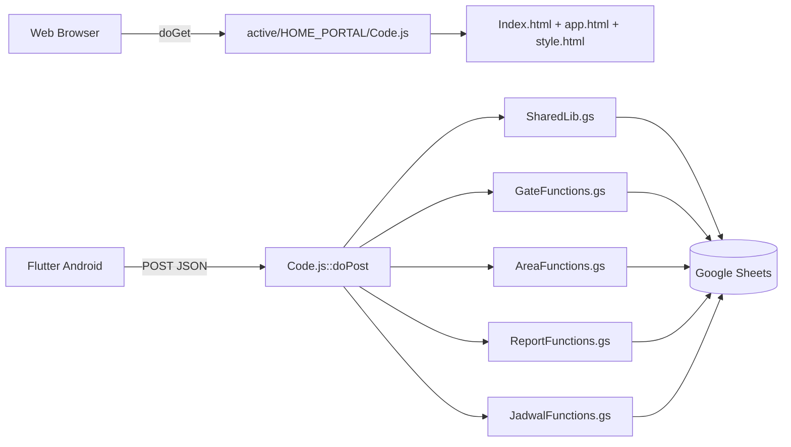
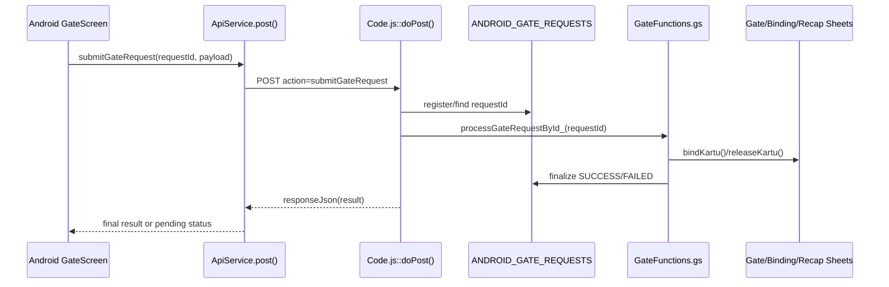

# Architecture Audit - 2026-08-17

## Scope

Audit ini memeriksa source of truth aktif berikut:

- `active/HOME_PORTAL/`
- `android_app/lib/`
- `docs/`

Tool yang dipakai dalam audit ini:

- GitNexus: `status`, `check`, `context`, `cypher`, `explain`
- Graphify: `update`, `query`, `export callflow-html`
- LangGraph: local state-graph check untuk drift dokumentasi/kontrak
- Python audit scripts:
  - `scripts/audit_project.py`
  - `scripts/extract_functions.py`
  - `scripts/compare_gas_runtime.py`

## Executive Summary

- Arsitektur inti masih konsisten: `HOME_PORTAL` tetap menjadi source of truth runtime untuk web shell, router Android, domain gate, area, report, dan jadwal.
- Integritas caller web ke backend GAS secara statis masih sehat. Audit Python tidak menemukan `google.script.run` yang memanggil fungsi runtime yang hilang.
- Integritas Android ke `doPost()` juga masih hidup, tetapi dokumentasi bridge sudah mulai drift dari implementasi Flutter yang aktif.
- Tidak ada cycle import yang terdeteksi oleh GitNexus.
- Tidak ada temuan taint-flow otomatis dari GitNexus PDG, tetapi ada loophole desain autentikasi Android yang tetap berisiko tinggi walau lolos dari taint scan.
- Dokumentasi arsitektur sudah bercampur antara yang masih relevan dan yang tertinggal. `GAS_ARCHITECTURE.md` dan `OPERATIONAL_WORKFLOW.md` relatif masih sehat; `FUNCTION_MAPPING.md`, `NEURAL_MAPPING.md`, `ANDROID_GAS_BRIDGE_MAP.md`, dan `AI_TOOLING_SETUP.md` sudah perlu sinkronisasi.

## Runtime Snapshot

- Python audit terakhir menghasilkan:
  - `211` GAS runtime functions
  - `373` frontend functions
  - `20` unique frontend GAS calls
  - `9` sheet constants aktif
- GitNexus index berhasil direfresh dengan `--force --pdg`
  - `4462` nodes
  - `10209` edges
  - `258` flows
- Keterbatasan tooling:
  - GitNexus masih membaca `Code.js` dengan baik, tetapi fungsi `.gs` tidak selalu terindeks sebagai simbol yang bisa dicari langsung.
  - FTS GitNexus tidak tersedia pada environment ini, jadi process search berbasis BM25 tidak bisa diandalkan penuh.
  - Graphify baru bisa dipakai setelah `graphify update . --no-cluster`; dokumentasi lama yang menyuruh `graphify scan` sudah tidak akurat.

## Architecture Map

## Findings

### Critical

1. Android security model masih mengandalkan API key statis yang dibundel di dua sisi, dan `doPost()` masih membuka action mutasi langsung.
   - Evidence:
     - `active/HOME_PORTAL/Code.js:220`
     - `active/HOME_PORTAL/Code.js:260`
     - `active/HOME_PORTAL/Code.js:263`
     - `active/HOME_PORTAL/Code.js:266`
     - `android_app/lib/config/api_config.dart:6`
   - Dampak:
     - Siapa pun yang mengetahui key dapat mencoba memanggil `bindKartu`, `releaseKartu`, `scanAreaKerja`, `getKaryawanByNIK`, atau action Android lain langsung ke endpoint Apps Script.
     - Jalur direct `bindKartu`/`releaseKartu` juga membuka bypass terhadap pola idempotent queue Android.
   - Catatan:
     - Tidak ditemukan guard backend tambahan berbasis session token, role, atau signature request pada cabang `doPost()` ini.

2. `verifySession()` Android bukan session verification yang sesungguhnya, melainkan lookup by NIK.
   - Evidence:
     - `active/HOME_PORTAL/Code.js:243`
     - `active/HOME_PORTAL/SharedLib.gs:1484`
   - Dampak:
     - `sessionToken || nik` pada Android tidak memberi properti autentikasi yang kuat.
     - Jika API key bocor, enumerasi NIK berarti enumerasi payload user.

### High

1. `verifyLogin()` mengizinkan akun dengan password kosong untuk lolos tanpa secret tambahan.
   - Evidence:
     - `active/HOME_PORTAL/SharedLib.gs:1470`
   - Dampak:
     - Untuk row karyawan yang kolom password-nya kosong, login efektif menjadi knowledge-of-NIK only.
   - Risiko:
     - Ini bisa saja sengaja dipakai secara operasional, tetapi secara security tetap menjadi loophole kalau Android/API key juga terekspos.

2. Basis dashboard mode `shift` di backend saat ini salah model karena `basisValue` dipakai sekaligus sebagai tanggal dan kode shift.
   - Evidence:
     - `active/HOME_PORTAL/AreaFunctions.gs:180`
     - `active/HOME_PORTAL/AreaFunctions.gs:183`
     - `active/HOME_PORTAL/app.html:1209`
     - `active/HOME_PORTAL/app.html:1243`
   - Dampak:
     - Frontend mengirim `db-shift-value` sebagai `shift1|shift2|shift3`.
     - Backend `buildBasisConfig()` tetap mencoba mem-parse `basisValue` itu sebagai tanggal.
     - Hasilnya, label shift masih terisi tetapi basis tanggal untuk mode shift diam-diam selalu jatuh ke `today`.
   - Gejala:
     - Filter shift terlihat bekerja, tetapi pemilihan tanggal shift tidak pernah benar-benar dibawa dari UI.

### Medium

1. Filter shift di `getKehadiranDashboard()` membiarkan row tanpa `shiftLabel` lolos walau user memilih shift tertentu.
   - Evidence:
     - `active/HOME_PORTAL/AreaFunctions.gs:665`
   - Dampak:
     - Record yang gagal dikenali shift-nya tetap ikut ke hasil filter shift, sehingga angka coverage/list bisa bias.

2. Deteksi anomali `DI_DALAM_TERLALU_LAMA` memakai jam `nowWIB()` global walau dashboard diminta untuk tanggal historis.
   - Evidence:
     - `active/HOME_PORTAL/AreaFunctions.gs:688`
   - Dampak:
     - Jika user membuka dashboard kehadiran untuk tanggal lampau, row `DI DALAM` yang memang belum ditutup pada tanggal itu akan diukur terhadap waktu hari ini, bukan terhadap konteks tanggal yang diminta.
   - Risiko:
     - False anomaly pada audit historis.

3. Android bridge map sudah drift dari aplikasi Flutter aktif.
   - Evidence:
     - `docs/ANDROID_GAS_BRIDGE_MAP.md:32`
     - `android_app/lib/screens/dashboard_screen.dart:71`
     - `android_app/lib/screens/gate_screen.dart:98`
   - Dampak:
     - Dokumen masih bilang `dashboard_screen.dart` memanggil `getDashboardData`, padahal yang dipakai sekarang adalah `getKehadiranDashboard`.
     - Action `getKaryawanByNIK` dipakai di Android, tetapi belum masuk ke action matrix.

4. Dokumentasi Graphify CLI sudah kadaluarsa.
   - Evidence:
     - `docs/AI_TOOLING_SETUP.md:36`
   - Dampak:
     - Instruksi `graphify scan . --output graphify-out` gagal di environment sekarang.
     - Command yang berhasil pada audit ini adalah `venv\\Scripts\\python.exe -m graphify update . --no-cluster`.

### Low

1. `FUNCTION_MAPPING.md` sudah tertinggal dari inventaris runtime aktual.
   - Evidence:
     - `docs/FUNCTION_MAPPING.md:5`
     - `reports/gas_runtime_comparison.json`
   - Dampak:
     - Dokumen masih menulis `202 GAS functions, 354 frontend functions`, sedangkan audit terbaru menghasilkan `211 GAS functions, 373 frontend functions`.

2. `NEURAL_MAPPING.md` masih membawa narasi locking lama.
   - Evidence:
     - `docs/NEURAL_MAPPING.md:117`
     - `docs/NEURAL_MAPPING.md:231`
     - `docs/NEURAL_MAPPING.md:581`
     - `active/HOME_PORTAL/AreaFunctions.gs:15`
     - `active/HOME_PORTAL/GateFunctions.gs:40`
     - `active/HOME_PORTAL/GateFunctions.gs:404`
   - Dampak:
     - Dokumen masih menggambarkan write path utama dibungkus `withDocumentLock()`, padahal runtime aktif sudah banyak pindah ke `withCardLock()` atau lock per-request/per-recap key.

## Integrity Review

### Masih Relevan

- `docs/GAS_ARCHITECTURE.md`
  - Secara umum masih sesuai dengan runtime aktif, terutama pemisahan `HOME_PORTAL` vs child modules.
- `docs/OPERATIONAL_WORKFLOW.md`
  - Ringkas, masih akurat, dan tidak banyak bertentangan dengan implementasi saat ini.
- `reports/GAS_RUNTIME_AUDIT.md`
  - Masih relevan sebagai generated snapshot dan cocok dengan static caller coverage.

### Drift / Kadaluarsa

- `docs/AI_TOOLING_SETUP.md`
  - Command Graphify lama.
- `docs/ANDROID_GAS_BRIDGE_MAP.md`
  - Caller/action matrix Android tidak sepenuhnya sinkron.
- `docs/FUNCTION_MAPPING.md`
  - Angka inventaris fungsi lama.
- `docs/NEURAL_MAPPING.md`
  - Beberapa bagian naratif dan snapshot angka sudah tertinggal.

### Redundancy

- Redundansi child module masih disengaja dan masih sesuai AGENTS:
  - `active/MODUL_GATE_PABRIK/`
  - `active/MODUL_AREA_KERJA/`
  - `active/MODUL_REPORT/`
- Tidak ditemukan redundansi runtime liar baru di source of truth utama, tetapi:
  - dokumentasi masih mengulang fakta yang sama di beberapa file,
  - angka/snapshot audit lama sudah tersebar di banyak dokumen dan mulai saling bertabrakan.

## Python Audit Cross-check

### Summary

- No missing `google.script.run` runtime dependencies were detected.
- Active runtime function coverage tetap baik untuk web shell.

### Critical Issues

- Tidak ada missing backend function untuk caller web.
- Ada broken-dependency static warning pada dependency sheet dinamis:
  - `active/HOME_PORTAL/DataRepairUtils.gs`
  - `active/HOME_PORTAL/GateFunctions.gs`
- Dari inspeksi source, warning ini lebih dekat ke keterbatasan static scan terhadap `sheetName` dinamis daripada crash runtime yang pasti.

### Missing Functions

- Web frontend runtime: tidak ada fungsi server yang hilang.
- Android bridge docs: ada miss-link dokumentasi pada `getKaryawanByNIK`.

### Broken Dependencies

- Graphify local artifact sebelum audit belum punya `graph.json`, walau `graphify-out/` sudah ada.
- GitNexus FTS extension tidak tersedia, jadi semantic search belum penuh.

## Generated Artifacts During Audit

- `reports/GAS_RUNTIME_AUDIT.md`
- `reports/function_inventory.md`
- `reports/gas_runtime_comparison.json`
- `graphify-out/graph.json` (local artifact)
- `graphify-out/0.-MK-EMP-TRACKER-callflow.html` (Mermaid-based local artifact)

## Recommended Fix Order

1. Keras-kan autentikasi Android:
   - tutup direct mutation route dari `doPost()` bila tidak perlu,
   - ganti API key statis dengan signature/token yang tidak dibundel polos di client,
   - jadikan `verifySession` sebagai verifikasi token nyata, bukan lookup by NIK.
2. Perbaiki bug backend dashboard:
   - pisahkan nilai tanggal dan kode shift untuk mode `shift`,
   - ketatkan filter shift di `getKehadiranDashboard`,
   - buat evaluasi anomali historis memakai konteks tanggal target.
3. Sinkronkan dokumentasi bridge Android dan tooling:
   - `ANDROID_GAS_BRIDGE_MAP.md`
   - `AI_TOOLING_SETUP.md`
4. Bersihkan drift dokumentasi inventaris/snapshot:
   - `FUNCTION_MAPPING.md`
   - `NEURAL_MAPPING.md`
5. Setelah fix runtime, rerun:
   - `python scripts/audit_project.py`
   - `venv\\Scripts\\python.exe scripts/extract_functions.py`
   - `venv\\Scripts\\python.exe scripts/compare_gas_runtime.py`
   - `node .gitnexus/run.cjs analyze --force --pdg`

